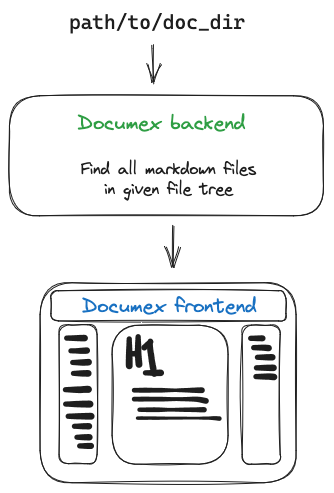

# Documex

> Documentation Explorer

1. Supply backend a local directory path with arbitrarily nested markdown files
2. Start up frontend which will
    - Display all markdown files found in the given directory in a tree structure
    - Render selected markdown file to read it

Start backend and frontend in same terminal window:
1. `make start`

Or separately as:
1. `cd backend && python main.py`
2. `cd frontend && npm run dev`

### `test_repos/`

This directory contains (relatively small) open-source repositories which all
contain markdown files at varying levels inside the respective repos.
This is a good directory to try out the (somewhat) intended purpose of this
application where you have a lot of repos with documentation (as markdown files)
scattered about.
This application should make it a little bit nicer to navigate and discover
these markdown files to give you a better overview of where which bit of
documentation exists.

## To do

- [x] (**BE**) Add option (and probably as default) to ignore directories like
    `.git/`, `node_modules/`, `.venv/`.
        - Partially done. Perhaps making this configurable would be nice
            as it is hardcoded right now
- [ ] (**FE**) Make the loading/selected/fetching an MD file path based
    - i.e. now `{filepath: "dir_1/dir_2/file.md"}` is sent in a POST request
        make this a GET request with URL `[localhost:3030]/dir_1/dir_2/file.md`
    - This will make reloading the page have the expected behavior as well
    - Perhaps adding a button to clear the selected file would be nice
    - Also when refreshing the browser would be nice if it didn't try to always
        fetch the file again (and list of files for the matter) each time but
        rather use some kind of cache we keep locally (in localStorage perhaps)
        such that we see some content faster!
- [ ] (**BE/FE**) Investigate using WebSockets to be able receive updates from the server
    in case the markdown file tree has changed and when the current selected
    md file's content has changed, send the new state/version so it can be
    seamlessly updated in the frontend.
- [ ] (**FE**) After a browser reload with a path in the URL, e.g.
    `localhost:3000/path/to/file.md`, make sure the loaded file in revealed
    in the file-tree sidebar (i.e. the part of the tree leading to this file
    should be visible). Additionally when reloading with and additional header
    ID in the URL, e.g. `localhost:3000/path/to/file.md#_header2`, it should
    scroll to this header ID just as it would when clicking on an on-page header
    from the right-sidebar when the content is already loaded.
- [ ] (**FE**) Make [GitHub task lists](https://docs.github.com/en/get-started/writing-on-github/working-with-advanced-formatting/about-task-lists) display properly
